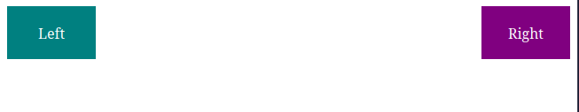

# Revisão de Posicionamento CSS

## Trabalhando com Floats

- **Definição**: Floats são usados para remover um elemento do seu fluxo normal na página e posicioná-lo à esquerda ou à direita do seu container. Quando isso acontece, o texto irá envolver esse conteúdo flutuante.

EX:
```css
float: left;
float: right;
```

- **Limpeza de Floats**: A propriedade `clear` é utilizada para controlar o comportamento de elementos em relação a elementos flutuantes(`float`). Quando um elemento recebe `clear: left`, `clear: right` ou `clear: both`, o mesmo é movido para baixo dos elementos flutuantes especificados, evitando que fique ao lado(envolva) deles. Em layouts que utilizam vários elementos com `float`, o elemento pai pode deixar de reconhecer a altura dos seus filhos flutuantes, causando o chamado "colapso do container". Para resolver esse problema foi criada a técnica do `clearfix`, que adiciona um elemento ou psudoelemento após os elementos flutuantes com a propriedade `clear`, forçando o container a expandir-se corretamente e envolver todo o seu conteúdo.

Vejamos um exemplo de uso da técnica `clearfix`:

```html
<link rel="stylesheet" href="styles.css"/>

<div class="clearfix">
  <div class="box left">Left</div>
  <div class="box right">Right</div>
</div>
```

```css
.box {
  width: 100px;
  height: 100px;
  color: white;
  text-align: center;
  line-height: 60px;
}

.left {
  float: left;
  background: teal;
}

.right {
  float: right;
  background: purple;
}

.clearfix::after {
  content: "";
  display: block;
  clear: both;
}
```


Após o `clearfix` aplicado ao container pai, qualquer elemento que venha em seguida seguirá o fluxo normal do documento.

## Posicionamento Estático, Relativo e Absoluto


## Posicionamento Fixo e Fixo Adesivo
## A Propriedade **z-index**