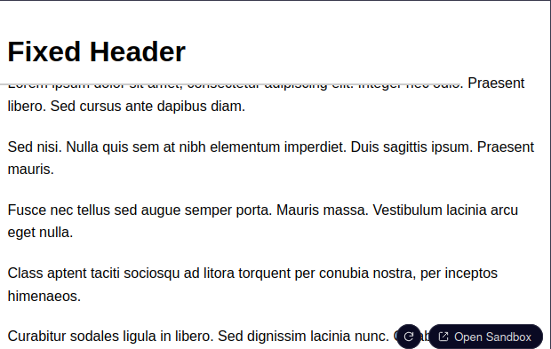

# Posicionamento Fixed e Sticky

O posicionamento fixed e sticky são duas estratégias importantes de posicionamento CSS, cada uma oferecendo comportamentos distintos em comparação com o posicionamento absolute.

## Fixed

Quando um elemento é posicionado com `position: fixed`, ele é removido do fluxo normal do documento e colocado em relação à viewport, o que significa que ele permanece na mesma posição mesmo quando o usuário rola a página. Isso é frequentemente usado para elementos como cabeçalhos ou barras de navegação que precisam permanecer visíveis o tempo todo.

Por exemplo se quisermos ter um título fixo no topo de nossa página web basta usarmos o seguinte código:

```html
<link rel="stylesheet" href="styles.css">
<h1>Fixed Header</h1>

<p>Lorem ipsum dolor sit amet, consectetur adipiscing elit. Integer nec odio. Praesent libero. Sed cursus ante dapibus diam.</p>
<p>Sed nisi. Nulla quis sem at nibh elementum imperdiet. Duis sagittis ipsum. Praesent mauris.</p>
<p>Fusce nec tellus sed augue semper porta. Mauris massa. Vestibulum lacinia arcu eget nulla.</p>
<p>Class aptent taciti sociosqu ad litora torquent per conubia nostra, per inceptos himenaeos.</p>
<p>Curabitur sodales ligula in libero. Sed dignissim lacinia nunc. Curabitur tortor.</p>
<p>Pellentesque nibh. Aenean quam. In scelerisque sem at dolor. Maecenas mattis.</p>
<p>Sed convallis tristique sem. Proin ut ligula vel nunc egestas porttitor. Morbi lectus risus.</p>
<p>Donec congue lacinia dui, a porttitor lectus condimentum laoreet. Nunc eu ullamcorper orci.</p>
<p>Quisque eget odio ac lectus vestibulum faucibus eget in metus. In pellentesque faucibus vestibulum.</p>
<p>Nulla at nulla justo, eget luctus tortor. Nulla facilisi. Duis aliquet egestas purus in blandit.</p>
```
```css
body {
  margin: 0;
  padding-top: 60px;
  font-family: Arial;
  line-height: 1.6;
}

h1 {
  position: fixed;
  top: 0;
  width: 500px;
  background: white;
  padding: 10px;
  border-bottom: 2px solid #ccc;
}

p {
  max-width: 600px;
  margin: 20px auto;
}
```


Neste exemplo o elemento &lt;h1&gt; ficará no topo da viewport e mesmo quando o usuário rolar a página, ele permanecerá no lugar. Isso é especialmente útil para criar elementos de UI presistentes, como header fixos e navegações sempre visíveis.

## Sticky

O posicionamento sticky comporta-se como um híbrido entre os posicionamentos relative e fixed. Inicialmente o elemento comporta-se como se estivesse posicionado relativamente, permanecendo dentro do fluxo do documento. No entanto, uma vez que o usuário rola o elemento além de um determinado ponto, ele "gruda" na viewport (geralmente no topo) e se comporta como se estivesse fixo. Isso é otimo para criar elementos como barras de navegação fixas, que só se tornam fixas quando o usuário rola até uma determinada posição.

Como com os outros exemplos para definir esta propriedade basta criarmos a seguinte declaração:

```css
elemento {
  position: sticky;
}
```

## Diferenças entre posicionamentos

- O posicionamento absoluto remove um elemento do fluxo do documento e o posiciona em relação ao ancestral posicionado mais próximo, ou ao bloco contêiner inicial se nenhum existir. O elemento permanece nessa posição independentemente da rolagem.
<br>
- O posicionamento fixo também remove o elemento do fluxo do documento mas o fixa em relação à viewport, significando que ele permanecerá visível no mesmo local mesmo quando a página for rolada.
<br>
- O posicionamento sticky mantém o elemento no fluxo normal inicialmente mas permite que ele fique fixo no lugar após rolar além de um limite definido.