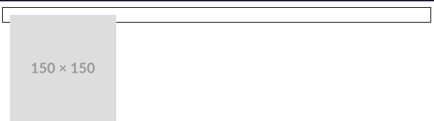
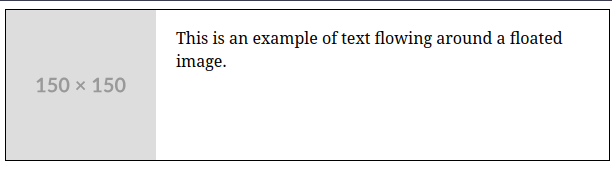

# Casos para uso de Floats e como funcionam

Floats são uma técnica CSS originalmente projetada para permitir que texto envolva conteúdo, multimídia como um imagem. Com o evuluir da técnologia CSS desenvolvedores encontraram novas maneirass de dar uso aos `floats`, aplicando-os ao design de layouts de formas mais criativas.

Embora tenhamos hoje em dia métodos como Flexbox e Grid Layout, entender o funcionamento e saber onde e quando usar um `float`, especialmente quando trabalhamos com código legado é importante.

Quando um elemento é flutuado, o mesmo é retirado do fluxo normal do documento e empurrado para esquerda ou direita de seu container. Já o conteúdo que o segue irá envolver o espaço restante, preenchendo assim o elemento flutuado.

## Exemplos de uso

Um exemplo classico de uso da técnica, é o envolvimento de texto ao redor de uma imagem ou outro elemento multimídia como um video, onde a imagem é flotuada e o texto usado para envolver a mesma.
Vejamos:

```html
<link rel="stylesheet href="styles.css/>

<div class="container">
  
</div>
```

```css
.container {
  border: 1px solid black;
  padding: 10px;
}

img {
  float: left;
  margin-right: 20px;
}
```



Como podes observar no exemplo a cima o container não envolve a imagem flutuante. A imagem está fora do fluxo normal do documento e o container colapsou para altura 0, porque o mesmo não consegue ver os seus elementos filhos flutuantes.

Ao usarmos `floats` é importante lidarmos com o problema do colapso dos elementos pai quando seus elementos filhos estão com `float`.

A técnica `clearfix` é a solução que veremos agora aplicada a nossa div de class `container`.

```html
<link rel="stylesheet" href="styles.css">
<div class="container">
  
  <p> This is an example of text flowing around a floated image.</p>
</div>
```

```css
.container {
 border: 1px solid black; 
}

/*ClearFix CSS*/
.container::after {
  content= "";
  display: block;
  clear: both; 
}

img {
  float: left;
  margin-right: 20px;
}
```



  - **::after** é um pseudo-elemento que adiciona um bloco invisível após o conteúdo do container.

  - **content: ""** garante que o pseudo-elemento esteja presente mas não exibe nenhum conteúdo.

  - **display: block** torna o pseudo-elemento um elemento de nível de bloco.

  - **clear: both** garante que o pseudo-elemento limpe ambos os lados de quaisquer elementos flutuantes acima dele.

  No exemplo acima, adicionamos um novo elemento de parágrafo para tornar o colapso mais perceptível. Como o parágrafo permanece no fluxo normal do documento, o contêiner se expande o suficiente para envolvê-lo. Então, aplicamos a técnica clearfix para corrigir o colapso e fazer com que a borda do contêiner seja exibida corretamente. 

  A técnica clearfix garante que o elemento pai envolva corretamente seus filhos flutuantes. Clearfix força o contêiner pai a "ver" os elementos filhos flutuantes adicionando uma propriedade clear após o conteúdo flutuante.