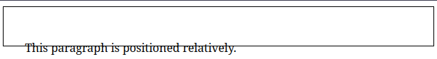

# Posicionamento Relativo - O que é e como difere do Posicionamento Estático Padrão

No CSS, o posicionamento permitenos controlar como os elementos são dispostos em uma página. Dois tipos comuns de posicionamento são o estático e o relativo.

Por padrão, os elementos são posicionados estáticamente, e isso significa que os mesmos seguem o fluxo normal do documento, um após o outro, de cima para baixo, da esquerda para a direita.

## Posicionamento Relativo

O posicinamento relativo, por outro lado, permite que um elemento seja deslocado de sua posição normal sem interromper o fluxo do documento. É como mover algo de sua posição estática padrão através de novas cordenadas.
Vejamos então como isso pode ser feito:

```html
<link rel="stylesheet" href="styles.css"/>

<p class="relative">This paragraph is positioned relatively.</p>
```
```css
body {
  border: 1px solid black;
}

.relative {
  position: relative;
  top: 30px;
  left: 30px;
}
```



Em nosso exemplo o parágrafo aparece 30 pixels mais para baixo e 30 pixels mais para a direita.
No entanto o espaço que o mesmo ocuparia no fluxo normal permanece preservado.
