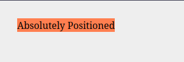
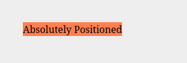

# O que é Posicionamento Absoluto

O posicionamento absoluto permite que retiremos um elmento do fluxo normal do documento, fazendo com que ele se comporte de forma independente dos outros elementos. Quando um elemento é posicionado de forma absoluta, ele é colocado em sua própria camada, completamente separada do resto do layout.

Isso torna este posicionamento extremamente útill para criar recursos de interface flutuantes como modais, tolltips ou menus dropdown, que podem sobrepor outros elementos na página.

Por padrão, elementos com posição absoluta são posicionados em relação ao ancestral posicionado mais próximo. Caso nenhum ancestral posicionado seja encontrado, o elemento será posicionado em relação ao bloco container inicial, geralmente a viewport do navegador.

Podemos mover o elemento usando as propriedades de: top, bottom, left e right, em conjunto com um valor em pixels para especificar a distância que ele deve ficar das bordas do seu ancestral posicionado.

Vejamos aogra um exemplo simples do uso de posicionamento absoluto:

```html
<link rel="stylesheet" href="styles.css"/>

<div class="positioned">Absolutely Positioned</div>
```
```css
body {
  bakcground-color: #eee;
}

.positioned {
  position: absolute;
  top: 30px;
  left: 30px;
  background-color: coral;
}
```


Neste exemplo acima o elemento posicionado está a ser movido tendo como ancestral posicionado a viewport.

Mas o método mais comumente usado para tal é criar um container com o simples porposito de ser o ancestral posicionado.
Vejamos como:

```html
<link rel="stylesheet" href="styles.css"/>

<div class="container">
  <div class="positioned">Absolutely Positioned</div>
</div>
```
```css
body {
  bakcground-color: #eee;
}

.container {
  position: relative;
}

.positioned {
  position: absolute;
  top: 30px;
  left: 30px;
  background-color: coral;
}
```


Neste exemplo o nosso elemento `absolute` está a ser posicionado relativamente a seu container de posicionamento relativo.
