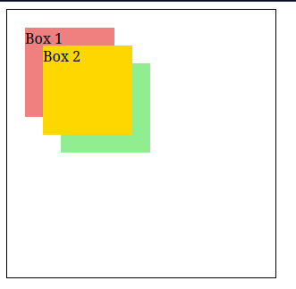

# O que é a propriedade **z-index**

A propriedade `z-index` no CSS é usada para controlar a ordem de emilhamento vertical de elementos posicionados que se sobrepõem na página.

Quando múltiplos elementos estão empilhados uns sobre os outros, o valor de `z-index` determina qual elemento aparece no topo.

Quanto maior o valor da propriedade, mais proximo o elemento estará do visualizador.

A propriedade `z-index` funciona apenas em elementos que esão posicionados, o que significa que o elemento deve ter um valor de posição diferente de `static`.

O valor padrão da propriedade é `auto`.

## Exemplos de uso

Vejamos um exemplo simples do uso da propriedade:

```html
<link rel="stylesheet" href="styles.css"/>

<div class="container">
  <div class="box3">Box 3</div>
  <div class="box1">Box 1</div>
  <div class="box2">Box 2</div>
</div>
```

```css
.container {
  position: relative;
  width: 300px;
  height: 300px;
  border: 1px solid black;
}

.box1 {
  position: absolute;
  z-index: 1;
  background: lightcoral;
  top: 20px;
  left: 20px;
  width: 100px;
  height: 100px;
}

.box2 {
  position: absolute;
  z-index: 3;
  background: gold;
  top: 40px;
  left: 40px;
  width: 100px;
  height: 100px;
}

.box3 {
  position: absolute;
  z-index: 2;
  background: lightgreen;
  top: 60px;
  left: 60px;
  width: 100px;
  height: 100px;
}
```


Podemos ver que o container em noss exemplo têm seu posicionamento definido como `relative` e que todas as nossas divs dentro do mesmo tiverão seu posicionamento definido como `absolute`.
Cada uma recebeu um valor diferente na propriedade `z-index`, o que resulta na sua sobreposição.

## Conclusão

Podemos pensar na propriedade **z-index** como uma forma de criar camadas em uma página web, na qual elementos com valores mais altos serão colocados acima daqueles com valores mais baixos.

Isto é algo que se torna extremamente útil para controlar como elementos sobrepostos se comportam em layouts complexos, como modais, pop-ups ou tooltips.
