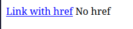
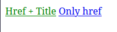
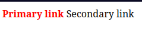
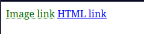

# Revisão de Seletores de Atributo em CSS

## Trabalhando com diferentes Seletores de atributo e links

- **Definição**: O seletor `atribute` permite que direionemos elementos HTML com base em seus atributos como os atributos `href` ou `title`.
Vejamos:

```html
<link rel="stylesheet" href="sytles.css"/>

<a href="https://www.freecodecamp.org">Link With href</a>
<a>No href</a>
```
```css
a[href] {
  color: blue;
  text-decoration: underline;
}
```


---

- **Atributo `title`**: Este atributo fornece informações adicionais sobre um elemento. Aqui está um exemplo de como podemos direcionar links com o atributo `title`.
Vejamos:

```html
<link rel="stylesheet" href="styles.css"/>

<a href="#" title="tooltip">Link with title</a>
<a href="#">Normal link</a>
```
```css
a[title] {
  font-weight: bold;
  text-decoration: none;
}
```


---

- **Combinando Seletores**: Combina múltiplos seletores de atributo.
Vejamos:

```html
<link rel="stylesheet" href="styles.css"/>

<a href="#" title="Info">Href + Title</a>
<a href="#">Only href</a>
```
```css
a[href][title] {
  color: green;
}
```


---

- **Selecionando uma única palavra dentro de uma lista**: Teremos como alvo links que possuem uma palavra de classe específica.
Vejamos:

```html
<link rel="stylesheet" href="styles.css"/>

<a class="link primary">Primary link</a>
<a class="link secondary">Secondary link</a>
```
```css
a[class≃"primary"] {
  color: red;
  font-weight: bold;
}
```

 
 ---

 - **Selecionar valores que iniciem com um prefixo específico**: Temos como alvo links que começam com `https://`.
 Vejamos:
 
 ```html
<link rel="stylesheet" href="styles.css"/>

<a href="https://www.freecodecamp.org">HTTPS link</a>
<a href="https://www.freecodecamp.org">HTTP link</a>
```
```css
a[href⁼"https://"] {
  color: green;
  text-decoration: underline;
}
```


---

- **Selecionar valores que terminam com um sufixo específico**: Destina-se a links que terminam com `.jpg`.
Vejamos:

```html
<link rel="stylesheet" href="styles.css"/>

<a href="photo.jpg">Image link</a>
<a href="inde.html">HTML link</a>
```
```css
a[href$=".jpg"] {
  color: darkgreen;
  text-decoration: underline dotted;
}
```


---

- **Selecionar valores que contenham uma substring em qualquer lugar**: Teremos como alvo links que contenham `https` em qualquer lugar de seu valor.

```html
<link rel="stylesheet" href="styles.css"/>

<a href="https://freecodecamp.org">Secure link</a>
<a href="page.html">Local link</a>
```
```css
a[href*="https"] {
  color: teal;
}
```


---

## Resumindo

Estes padrões facilitam a seleção de atributos especificos para estilização concreta de determinados elementos com base em seus atributos e valores.
