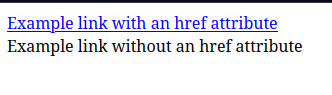
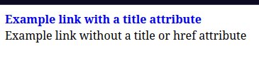

# O que é um Seletor de Atributo e como pode ser usado

O seletor de atributo em CSS é uma ferramenta poderosa que permite direcionar elemetos HTML com base em seus atributos. Isso significa que podemos aplicar stilos a elementos que possuem atributos especificos, ou até mesmo estilizar os elementos conforme certos valores dentro desses atributos.

Pode ser particularmente útil quando queremos estilizar elementos dinamicamente ou quando apenas os nomes das classes não fornecem especificidade suficiente.

## Exemplo de uso

### Atributo href

Podemos por exemplo, fazer uso do seletor de atributo para direcionar todos os links que possuem um atributo href. Isto é bastante útil pois irá permitirnos aplicar um estilo uniforme a todos os links em uma página que possuam o atrirbuto href.
Vejamos:

```html
<link rel="stylesheet" href="styles.css"/>

<a href="https://example.com">Example link with href attribute</a>
<a>Example link without href attribute</a>
```
```css
a {
  display: block;
}

a[href] {
  color: blue;
  text-decoration: underline;
}
```


Como vemos no exemplo acima a regra CSS aplica uma cor azul e um sublinhado a qualquer link que inclua o atributo `href`, grantindo que todos os links clicáveis sejam estilizados de forma consistente.

### Atributo title

Do mesmo modo que decidimos criar um seletor de atributo para o atributo `href`, poderiamos ter criado um seletor para qualquer outro atributo, como: `title`.
Vejamos o exemplo seguinte:

```html
link rel="stylesheet" href="styles.css">
<a href="https://example.com" title="Example link with a title attribute">Example link with a title attribute</a>
<a>Example link without a title or href attribute</a>
```
```css
a {
  display: block;
}

a[title] {
  font-weight: bold;
  text-decoration: none;
}
```


Podemos ver o resultado desta regra CSS onde foi aplicado o peso em negrito e removido o sublinhado de qualquer link co um atributo `title`.

### Combinações

Podemos ainda combinar seletores de atribtuo para obter resultados ainda mais precisos. Como por exemplo, se quisermos estilizar links que tenham os atributos `href` e `title`, basta para isso criarmos o seguinte seletor:

```css
a[href][title] {
  color: blue;
}
```

Neste caso apenas links que contenham os atributos `href` e `title` serão estilizados com o texto azul. 

Este nível de controle é aquilo que torna os seletores de atributo tão poderosos no **CSS**

### Selecionando através de **class**

Outro exemplo para um seletor de atributo é corresponder a um único valor dentro de uma lista de valores separados por espaço em um atributo como um identificador de `class`.
Vejamos o seguinte exemplo:

```html
<link rel="stylesheet" href="styles.css"/>

<a href="https://example.com" class="btn primary large">Visit Example Site</a>
```
```css
a[class≃"primary"] {
  color: red;
  font-weight: bold;
}
```


A sintaxe **[attr≃value]** é usada aqui para selecionar todos os elementos anchor onde o atributo class contém a palavra "primary".

Se precisarmos direcionar um elmento onde o valor do atributo é prefixado por um valor específico, então podemos usar a sintaxe **[attr⁼value]**.
Aqui está um exemplo disso:

```html
<link rel="stylesheet" href="styles.css">
<a href="https://example.com" class="btn primary large">Visit Example Site</a>
```
```css
a[href⁼"https://"] {
  color: green;
  text-decoration: underline;
}
```


Neste exemplo, o seletor **a[href⁼"https://"]** irá selecionar todos os elementos anchor onde o valor do atributo href começa com **"https://"**

Para direcionarmos elementos anchor onde o valor do atributo termina com um valor especifico, podemos usar a sintaxe **[attr$=value]**. Assim como no seguinte exemplo:

```html
<link rel="stylesheet" href="styles.css">
<a href="https://example.com">Visit Example Site</a>
```
```css
a[href$=".com"] {
  color: darkgreen;
  text-decoration: underline dotted;
}
```


Neste exemplo o seletor **a[href$=".com"]** irá selecionar todos os elementos anchor onde o valor do atributo href termina com **.com**

## Conclusão

Usar seletores de atributo não só melhora o estilo de sua página web como também aprimora a acessibilidade tornando elementos interativos como links mais distinguiveis com base em seus atributos.
