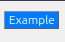

# O que são Hex Codes e como funcioam em CSS?

Ao trabalharmos com o CSS para estilizar uma página web, um dos métodos mais comuns para definir cores é usando valores de cor 'hexadecimais'. Valores Hexadecimais ou 'hex', são uma forma concisa de representar cores no modelo de cores RGB.
Iremos nesta lição explorar e entender melhor o que são códigos headecimais e como os mesmo funcionam.

Um código hexadecimalé uma string de seis caracteres usada para respresentar cores no modelo RGB. O 'hex' refere-se ao sistema de numeração base-16, que usa numeros de 0 a 9 e letras de A a F.

No contexto das cores, os códigos hezadecimais especificam as quantidades de vermelho, verde e azul (RGB) que compõem uma cor específica. Cada código hexadecimal começa com um símbolo de #, seguido de seis caracteres que representam respectivamenete o valor para vermelho, verde e azul.

No css podemos aplicar cores fazendo uso de hex codes, que usam a seguinte sintaxe de base:

```css
element {
    color: #RRGGBB;
}
```

Como vemos no nosso exemplo #RRGGBB é um espaço reservado para o código hexadecimal real. Os pares RR, GG e BB representam cada um a intensidade do vermelho, verde e azul respectivamente.

Estes pares podem variar entre 00(intensidade mais baixa) a FF(a intensidade mais alta).
Quanto maior o número, mais daquela cor estará presente na mistura final.

## As Vantagens dos códigos Hexadecimais

Códigos Hexadecimais são populares porque são precisos e faceis de usar. Eles permitem que façamos ajustes nas nossas cores com precisão, tornando-as ideais para designs onde a consistenia é importante.

A grande maioria de Softwares de design, como o Adobe Photshop ou Figma, fornecem códigos hexadecimais para as cores que selecionamos, o que facilita copiar e colar esses valores directamente nos nossos arquivos.

No desenvolvimento Web, códigos hexadecimais são frequentemente usados para definir cores de texto, fundos bordas e outros elementos visuais. Por exemplo:

```html
<link rel="stylesheet" href="styles.css"/>

<button>Example</button>
```
```css
body {
    background-color: #f0f0f0; /* Light gray(cinza claro) background */
}

button {
    background-color: #007bff; /* A shade of blue */
    color: #ffffff; /* Texto em cor branca*/
}
```
Resultado:


Em alguns casos podemos notar ainda código hexadecimal escrito no formato abreviado, usando apenas três carateres em vez de seis. Isto é possivel quando ambos os caracteres em um par de cores são iguais.
