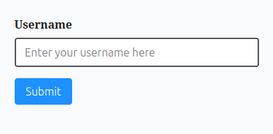
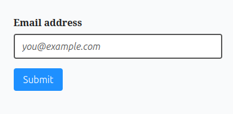
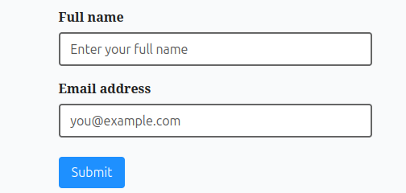

# Quais são as melhores práticas para estilizar inputs de texto?

## Elemento input

Como em todos os elementos de texto, precisamos garantir que os estilos aplicados ao "text input" sejam acessíveis. Isso significa que a fonte precisa ter um tamanho adequado e a cor precisa ter contraste suficiente com o fundo.

Exemplo:

```html
<link rel="stylesheet" href="styles.css">

<form class="accessible-form>
    <label for="username">Username</label>
    <input type="text" id="username" name="username" placeholder="Enter your username here">
    <button type="submit">Submit</button>
</form>
```

```css
body {
    background-color: #f9fafb;
    color: #222;
    padding: 2rem;
}

.accessible-form {
    max-width: 320px;
    margin: 0 auto;
}

label {
    display: block;
    font-weight: 600;
    margin-bottom: 0.5rem;
}

input[type="text"] {
  width: 100%
  padding: 0.6rem 0.8rem;
  font-size: 1rem;
  border: 2px solid #555;
  border-radius: 4px;
  background-color: #fff;
  color: #111;
}

input[type="text"]:focus {
    outline: 3px solid #1e90ff;
    border-color: #1e90ff;
}

button {
    margin-top: 1rem;
    padding: 0.6rem 1rem;
    font-size: 1rem;
    background-color: #1e90ff;
    color: #fff;
    border: none;
    border-radius: 4px;
    cursor: pointer;
}

button:hover, button:focus {
    background-color: #187bcd;
}
```
Resultado do Exemplo:



* * * 

## Atributo placeholder

O atributo de "placeholder", no entanto é frequentemente esquecido. É importante lembrar que isso também é texto e que podemos alterar o estilo do mesmo para garantirmos uma melhor legibilidade.

Exemplo:
label
```html
<link rel="stylesheet" href="styles.css">

<form class="accessible-form>
    <label for="email>Email address</label>
    <input type="email" id="email" name="email" placeholder="you@example.com>
    <button type="submit">Submit</button>
</form>
```

```css
body {
    background-color: #f0fafb;
    color: #222;
    padding: 2rem;
}

.accessible-form {
    max-width: 320px;
    margin: 0 auto;
}

label {
    display: block;
    font-weight: 600;
    margin-bottom: 0.5rem;
}

input[type="email"] {
    width: 100%;
    padding: 0.6rem 0.8rem;
    font-size: 1rem;
    border: 2px solid #555;
    border-radius: 4px;
    background-color: #fff;
    color: #111;
}

input[type="email"]::placeholder {
    color: #555;
    opacity: 1;
    font-style: italic;
}

input[type="email"]:focus {
    outline: 3px solid #1e90ff;
    border-color: 1e90ff;
}

button {
    margin-top: 1rem;
    padding: 0.6rem 1rem;
    font-size: 1rem;
    background-color: #1e90ff;
    color: #fff;
    border: none;
    border-radius: 4px;
    cursor: pointer;
}

button:hover, button:focus {
    background-color: #187bcd;
}
```
Resultado do Exemplo:



* * * 

## Redimensionar inputs e textareas

Outra coisa a ter em mente é que você deve permitir que o usuário modifique o input. Por exemplo, se for uma área de texto (textarea) não devemos remover a capacidade de redimensioná-la. O input também deve escalar adequadamente quando o usuário der zoom na página.

Exemplo:

```html
<link rel="stylesheet" href="styles-css">

<form class="accessible-form">
    <label for="message">Your message</label>
    <textarea id="message" name="message" placeholder="Type ypur message here..."></textarea>
    <button type="submit">Send</button>
</form>
```

```css
body {
    background-color: #f9fafb;
    color: #222;
    padding: 2rem;
    line-height: 1.5;
}

.accessible-form {
    max-width: 480px;
    margin: 0 auto;
}

label {
    display: block;
    font-weight: 600;
    margin-bottom: 0.5rem;
}

textarea {
    width: 100%;
    min-height: 120px;
    padding: 0.8rem;
    font-size: 1rem;
    border: 2px solid #555;
    border-radius: 4px;
    background-color: #fff;
    color: #111;
    resize: both;
    box-sizing: border-box;
}

textarea::placeholder {
    color: #555;
    opacity: 1;
}

textarea:focus {
    outline: 3px solid #1e90ff;
    border-color: #1e90ff;
}

button {
    margin-top: 1rem;
    padding: 0.6rem 1rem;
    font-size: 1rem;
    background-color: #1e90ff;
    color: #fff;
    border: none;
    border-radius: 4px;
    cursor: pointer;
}

button:hover, button:focus {
    background-color: #187bcd;
}
```
Resultado do Exemplo:


* * * 

## Foco no elemento de input

Elementos de input também podem receber foco. Ao editarmos nossos estilos devemos garantir que preservamos um indicador visível quando o elemento estiver com "foco", como uma borda em negrito.

Exemplo:

```html
<link rel="stylesnameheet" href="styles.css">

<form class="accessible-form>
    <label for="name">Full name</label>
    <input type="text id="name" name="name" placeholder="Enter your full name">
    
    <label for="email">Email address</label>
    <input type="email" id="email" name="email" placeholder="you@example.com">
    
    <button type="submit">Submit</button>
</form>
```

```css
body {
    background-color: #f9fafb;
    color: #222;
    padding: 2rem;
}

.accessible-form {
   max-width: 360px;
   margin: 0 auto;
}

label {
    display: block;
    font-weight: 600;
    margin-top: 1rem;
    margin-bottom: 0.5rem;
}

input[type="text"], input[type="email"] {
    width: 100%;
    padding: 0.6rem 0.8rem;
    font-size: 1rem;
    border: 2px solid #666;
    border-radius: 4px;
    background-color: #fff;
    color: #111;
    transition: border-color 0.2s, box-shadow 0.2s;
}

input::placeholder {
    color: #555;
    opacity: 1;
}

input:focus {
    border-color: #1e90ff;
    box-shadow: 0 0 0 3px rgba(30, 144, 255, 0.4);
    outline: none;
}

button {
    margin-top: 1.5rem;
    padding: 0.6rem 1rem;
    font-size: 1rem;
    background-color: 1e90ff;
    color: #fff;
    border: none;
    border-radius: 4px;
    cursor: pointer;
}

button:hover, button:focus {
    background-color: #187bcd;
}
```
Resultado do Exemplo:



* * * 

