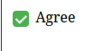

# Quando devemos usar - appearance: none - Para resolver problemas de estilização em inputs de busca e checkboxes?

- Vamos aprender nesta seção quando usar a regra: appearance: none; para resolver problemas de estilo em campos de busca, caixas de seleção e botões de opção.

Os navegadores aplicam estilos padrão a muitos elementos. No caso dos elementos de input, sua capacidade de estiliza-los com CSS pode parecer bastante restrita. Então, podemos querer usar a regra: appearance: none; para ocultar aspectos do elemento padrão  e construir o nosso próprio no lugar. Por exemplo, isso ocultaria as caixas de seleção padrão para um input do tipo checkbox permitindo que façamos uso de indicadores personalizados, como um tique verde e um X vermelho para mostrar o estado. Para um campo de busca, navegadores baseados em WebKit mostrarão um ícone de busca padrão e um botão de cancelar. Ocultar isso permite que criemos nossos próprios indicadores que apareceriam em todos os navegadores onde nossa página for aberta.

Veremos a baixo um exeplo de uma checkbox personalizada:

```html
<link rel="stylesheet" href="styles.css">
<form>
    <label>
        <input class="checkbox" type="checkbox"/> Agree
    </label>
</form>
```

```css
.checkbox {
    appearance: none;
    width: 18px;
    height: 18px;
    border: 2px solid #ccc;
    border-radius: 4px;
    display: inline-block;
    position: relative;
    cursor: pointer;
    transition: all 0.25s ease;
    vertical-align: middle;
}

.checkbox:hover {
    border-color: #888;
}

.checkbox:checked {
    backgorund-color: #4caf50;
    border-color: #4caf50;
}

.checkbox:checked::after {
    content:"";
    position: absolute;
    left: 4px;
    top: 0px;
    width: 5x;
    height: 10px;
    border: solid white;
    border-width: 0 2px 2px 0;
    transform: rotate(45deg);
}

.checkbox:focus {
    outline: 2px solid #90caf9;
    outline-offset: 2px;
}
```
Resultado do Exemplo:



* * * 

## WebKit

O WebKit é um motor de software que ajuda os navegadores a exibirem sites. Navegadores como Safari usam WebKit para garantir que as páginas da web apareçam e funcionem corretamente. Este propriedade CSS appearance: none; oferece controle total sobre o etilo, mas tráz algumas coisas para ficar atento. Os componentes interativos padrão dos elementos de input incluem recursos como indicadores de foco e de erro que devemos garantir que não sejam perdidos.

Criar um estilo consistente entre plataformas é uma ótima razão para usar essa propriedade. Podemos também usá-lo para garantir que os alvos de toque em um dispositivo móvel sejam grandes o suficiente ou que as cores de uma caixa de seleção tenham contraste suficiente.
