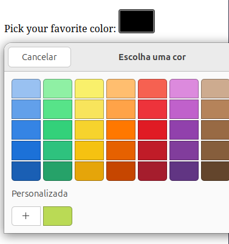
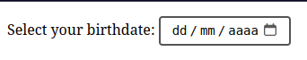

# Quais são os problemas comuns ao Estilizar Elementos de Entrada(inputs) Especiais?

- Vamos nesta lição aprender sobre alguns dos problemas comuns ao tentar estilizar elementos de entrada especiais como os inputs: datetime-local e color.

Estes tipos especiais de entrada dependem de pseudo-elementos complexos para criar coisas como os seletores de data e cor. Isso apresenta um desafio significativo para estilizar esses inputs. O desafio é o seguinte, como a estilização padrão depende inteiramente do tipo de browser escolhido, o CSS que faz o nosso color-picker parecer bem em um irá ou poderá faze-lo parecer não tão bom em outro Web Browser mostrando assim um resultado completamente diferente.

Vejamos um exemplo de um input de cor:

## Favorite-Color Picker

```html
<link rel="stylesheet" href="styles.css">

<form>
    <label for="favorite-color">Pick your favorite color:</label>
    <input type="color" id="favorite-color" name="favorite-color">
</form>
```

```css
input {
    padding: 8px 12px;
    margin: 8px 0;
    border-radius: 6px;
    border: 1px solid #ccc;
}

input[type="color"] {
    width: 60px;
    height: 40px;
    padding: 0;
    border 2px solid #555;
    border-radius: 4px;
    cursor: pointer;
}
```
Resultado do Exemplo:



* * * 

Outra dificuldade pode ser a complexidade do pseudo-elemento. Considere o seletor de data, onde existem muitas partes moveis e a estrutura complexa do pseudo-elemento pode representar um desafio significativo na aplicação de etilos as áreas corretas.

Vejamos em seguida um exemplo usando um input type="date":

```html
<link rel="stylesheet" href="styles.css">

<form>
    <label for="birthdate">Select your birthdate:</label>
    <input type="date" id="birthdate" name="birthdate">
</form>
```

```css
input {
    padding: 8px 12px;
    margin: 8px 0;
    bordar-raius: 6px;
    border: 1px solid #ccc;
}

input[type="date"]{
    padding: 6px 10px;
    border: 2px solid #555;
    border-radius: 4px;
    font-size: 14px;
    cursor: pointer;
}

input[type="date"]::-webkit-calendar-picker-indicator {
    background-color: #4CAF50;
    color: white;
    border-radius: 4px;
    cursor: pointer;
}
```
Resultado do Exemplo:



* * * 

Claro que com estes elementos complexos, corremos ainda o risco de perder acidentalmente funcionalidades importantes quando os estilizamos manualmente.
Poderiamos não só perder indicadores importantes como o estado de foco, ou o item selecionado, como também poderiamos potencialmente quebrar o "seletor" por inteiro.

Por esse motivo muitos desenvolvedores dependem de bibliotecas JavaScript ou componentes personalizados inteiramente em vez de usar os componentes embutidos do navegador.
