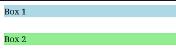
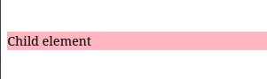

# O que é Margin Collapsing e como funciona?

O colapso de margens é um conceito fundamental em CSS.
Esse comportamento ocorre quando as margens verticais de elementos adjacentes se sobrepõem, resultando em uma única margem igual à maior das duas.

Entender o colapso de margens é importante para o controle preciso do espaçamento e do layout no Web Design. Então vamos entender como o margin collapsing funciona e explorar alguns cenários comuns onde ele ocorre.

No CSS, quando duas margens verticais entram em contacto uma com a outra,  elas colapsam, isso significa que em vez de se somarem, a margem maior vence e determina o espaço entre os elementos. Esse comportamento  se aplica apenas as margens verticais (superior e inferior) e não às margens horizontais (esquerda e direita). Então, aqui está um exemplo para ilustrar esse conceito: 

```html
<style>
    .box1 {
        margin-bottom: 20px;
        background-color: lightblue;
    }
    
    .box2 {
        margin-top: 30px;
        background-color: lightgreen;
    }
</style>

<div class="box1">Box 1</div>
<div class="box2">Box 2</div>
```

Resultado:


Como vemos no exemplo a cima o esperado seria termos um espaço total entre a .box1 e .box2 de 50px, que equivale a soma de ambas as margens.
No entanto devido ao colapso das margens o espaço real será de 30 pixels, que é a maior das duas margens.

Este é um dos casos mais simples de colapso de margens. Mas vamos explorar mais casos onde o colapso de margens pode ocorrer.

As margens também podem colapsar entre um elemento pai e seu primeiro ou último filho.
Se não houver borda, padding, conteúdo inline ou espaçamento para separar a margem do pai da margem do filho, elas irão colapsar.
Vejamos:

```html
<style>
    .parent {
        margin-top: 40px;
        backgroun-color: lightyellow;
    }
    
    .child {
        margin-top: 30px;
        background-color: lightpink;
    }
</style>

<div class="parent">
    <div class="child">Child element</div>
</div>
```
Resultado:


Neste exemplo que vimos a cima podiamos esperar que o filho estivesse a 70 pixels do topo.
No entanto, as margens colapsam e a margem maior de 40 pixels é usada.

Se um elemento não tiver conteúdo, padding ou borda, suas margens superior e inferior podem se fundir em uma única margem.
