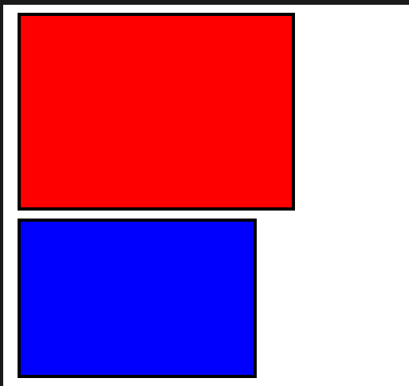

# Qual é a diferença entre content-box e border-box?

A propriedade box-sizing pode ser definida como content-box ou border-box para controlar como a largura e a altura dos elementos são calculadas.

Esta propriedade pode ser definida no seletor universal (*) para aplicar a todos os elementos do documento:

```CSS
* {
    box-sizing: border-box;
}
```

O valor padrão da propriedade box-sizing é o content-box, iremos cimeçar por explorar esse valor e depois passaremos ao border-box.

Para entendermos como estes modelos funcionam precisamos estar familiarizados com os quatro conceitos principais do modelo de caixa CSS. Vamos revisá-los rápidamente.

• A área de conteúdo é o espaço ocupado pelo conteúdo do elemento.
• O padding é o espaço entre a área de conteúdo e a borda.
• A borda é o contorno que envolve a área de conteúdo e a borda.
• A margem é o espaço fora da borda que separa o elmento de outros elementos.

---

## Content-box

Neste modelo, a largura e a altura que definimos para um elemento determinam as dimensões da área de conteúdo, mas não incluem o padding, border ou margin.
Usamos este modelo caso seja necessario um controle mais preciso sobre o conteúdo apenas, ao definirmos height e width estaremos definindo apenas o tamanho do proprio conteúdo.

Para encontrarmos a altura ou largura usando o modelo pré-definido do border-box precisaremos então de somar o total do conteúdo com os paddings em ambos os lados e as borders também.

Vejamos o seguinte exemplo:

```html
<link rel="stylesheet" href="styles.css"/>
<div></div>
```

```css
div {
    width: 300px;
    height: 200px;
    padding: 20px;
    border: 4px solid black;
}
```

Neste caso como não definimos qualquer valor para a propriedade box-sizing estamos a usar o modelo content-box.

• Área de conteúdo: 300px x 200px
• Tamanho total renderizado - Largura: 300px(conteúdo) + 40px(padding) + 8px(borders) = 348px

Para sabermos a área total é so seguir a formúla.

---

## Border-box

A grande diferença entre o já visto content-box e o border-box é que tanto a sua largura quanto sua altura incluem: o conteúdo do elemento, padding e borders (a margem fica de fora).
Usamos border-box muitas vezes quando queremos ter um tamanho total de elemento fixo mesmo ao alterarmos o seu padding ou bordas o elemento não irá alterar a medida por nós estipolada, o que é uma enorme ajuda ao trabalharmos com designs responsivos.

No exemplo que irei mostrarvos em seguida teremos dois elementos &lt;div&gt; com as mesmas dimensões mas valores de box-sizing diferentes. Observa como isso resulta em ta="manhos totais diferentes.
Vejamos:

```html
<link rel="stylsheet" href="styles.css"/>

<div class="box" id="red-div"></div>
<div class="box" id="blue-div></div>
```

```css
.box {
    width: 300px;
    height: 200px;
    padding: 20px;
    border: 4px solid black;
    margin: 10px;
}

#red-div {
    box-sizing: content-box;
    background-color: red;
}

#blue-box {
    box-sizing: border-box;
    background-color: blue;
}
```

Resultado:


Podes observar que ambos tê os mesmos valores de width, height, padding e border, e que a única diferença entre ambas as box's é a propriedade box-sizing, esta pequena diferença têm um ipacto enorme e muito importante nas dimensões finais.

---

## Conclusão

Escolher entre content-box e border-box realmente depende das necessidades específicas do seu projeto. Embora border-box esteja se tornando cada vez mais popular por sua simplicidade e flexibilidade, entender ambos os modelos é importante para implementar layouts CSS eficazes.
