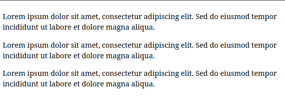

# OverFlow o que é e como funciona em CSS

OverFlow refere-se à forma como os elementos lidam com conteúdo que excede ou transborda o tamanho do elemento contêiner. Por exemplo, o conteúdo de texto de um elemento div pode transbordar para fora de suas bordas.

O overflow  é algo bidimensional, o eixo x determina o overflow horizontal e o eixo y determina o overflow vertical.

Veremos em seguida um exemplo onde iremos corrigir o overflow no nosso exemplo usando a propriedade CSS overflow-y, que fará a correção vertical.
Iremos primeiramente ocultar por completo o overflow com o valor :hidden; assim:

```html
<link rel="stylesheet" href="styles.css"/>

<div>
    <p>Lorem ipsum dolor sit amet, consectetur adipiscing elit. Sed do eiusmod tempor incididunt ut labore et dolore magna aliqua.</p>
  <p>Lorem ipsum dolor sit amet, consectetur adipiscing elit. Sed do eiusmod tempor incididunt ut labore et dolore magna aliqua.</p>
  <p>Lorem ipsum dolor sit amet, consectetur adipiscing elit. Sed do eiusmod tempor incididunt ut labore et dolore magna aliqua.</p>
  <p>Lorem ipsum dolor sit amet, consectetur adipiscing elit. Sed do eiusmod tempor incididunt ut labore et dolore magna aliqua.</p>
  <p>Lorem ipsum dolor sit amet, consectetur adipiscing elit. Sed do eiusmod tempor incididunt ut labore et dolore magna aliqua.</p>
</div>
```

```css
div {
    height: 200px;
    overflow-y: hidden;
}
```
Resultado:


Isto resolveu o problema de overflow mas agora o contéudo extra se torna completamente inacessivel. Então em vez de usarmos o valor hidden podemos usar o valor scroll para forçar o elemento a se tornar rolável.
Vejamos:

```html
<link rel="stylesheet" href="styles.css">

<div>
  <p>Lorem ipsum dolor sit amet, consectetur adipiscing elit. Sed do eiusmod tempor incididunt ut labore et dolore magna aliqua.</p>
  <p>Lorem ipsum dolor sit amet, consectetur adipiscing elit. Sed do eiusmod tempor incididunt ut labore et dolore magna aliqua.</p>
  <p>Lorem ipsum dolor sit amet, consectetur adipiscing elit. Sed do eiusmod tempor incididunt ut labore et dolore magna aliqua.</p>
  <p>Lorem ipsum dolor sit amet, consectetur adipiscing elit. Sed do eiusmod tempor incididunt ut labore et dolore magna aliqua.</p>
  <p>Lorem ipsum dolor sit amet, consectetur adipiscing elit. Sed do eiusmod tempor incididunt ut labore et dolore magna aliqua.</p>
</div>
```

```css
div {
    height: 200px;
    overflow-y: scroll;
}
```
Resultado:


OBS: infelizmente não me é possivel capturar a barra de rolagem vertical mas ela esta lá.

---

Transformamos o container em um elemento rolável, permitindo que todo o conteúdo seja visualizado rolando o elemento independentemente da rolagem da página. Também poderíamos deixar o navegador lidar com isso sozinho com o valor 'auto'.
Vale ressaltar que a rolagem vertical é geralmente considerada aceitável enquanto a rolagem horizontal pode ser questionada, pois geralmente não é uma decisão comum de design.
