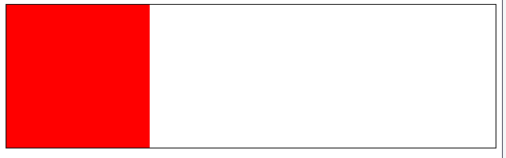
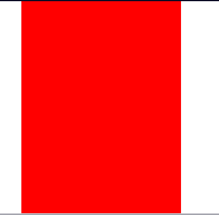
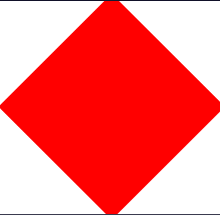

# O que é a propriedade CSS Transform e como ela funciona?

A propriedade CSS transform é uma ferramenta poderosa que permite modificar a apresentação visual dos elementos na nossa página da web sem afetar o layout de outros elementos. Ela permite que possamos aplicar várias transformações a elementos como rotacionar, escalar, inclinar ou transladar(mover) os elementos no espaço em 2D ou 3D.

A propriedade transform funciona aplicando uma transformação matemática ao sistema de coordenadas de um elemento. Isso significa que você pode manipular a forma e a posição de um elemento enquanto mantém seu lugar original e o fluxo do documento intactos.

Vamos explorara algumas funções de transformação comuns. Aqui está um exemplo de um elemento box:

```html
<link rel="stylesheet" href="styles.css"/>

<div class="box"></div>
```

```css
body {
   border: 2px solid black; 
}

.box {
    width: 200px;
    height: 200px;
    background-color: red;
}
```
Resultado:


No nosso exemplo, definimos o body para que o mesmo tenha uma borda preta solida, para que possas ver o elemento .box aninhado dentro do elemento body.

---

## Translate

A função trasnlate move um elemento da sua posição atual. Aqui está um exemplo atualizado usando a função translate:

```html
<link rel="stylesheet" href="styles.css"/>

<div class="box"></div>
```

```css

body {
    border: 2px solid black;
}

.box {
    width: 200px;
    height: 200px;
    background-color: red;
    transform: translate(50px, 100px);
}
```
Resultado:


Como vemos, esta regra CSS moverá o elemento com a class .box 50 pixels para a direita e 100 pixels para baixo a partir da sua posição original.

---

## Rotate

A função 'rotate' gira um elemento em torno de um ponto fixo e este é um exmplo de uso da função 'rotate' para o elemento .box mencionada anteriormente:

```html
<link rel="stylesheet" href="styles.css"/>

<div class="box></div>
```

```css
.box {
    margin: 100px;
    width: 200px;
    height: 200px;
    background-color: red;
    transform: rotate(45deg);
}
```
Resultado:


Como podes ver por nosso exemplo a função 'rotate' girou o elemento em 45 graus, o giro para valores positivos é feito no sentido horario.

---

## Scale

A função 'scale' permite que alteres o tamanho de um elemento. Vejamos um exemplo do mesmo em seguida.

OBS: devido ao código html ser o mesmo que o usado em exemplos anteriores existe apenas a necessidade de mostrar o código em css.

Exemplo:
```css
.box {
    margin: 100px;
    width: 200px;
    height: 200px;
    background-color: red;
    transform: scale(1.5, 2);
}
```

Resultado:


Como podemos ver através de nosso exemplo, o elemento ficou uma vez e meia mais largo, e duas vezes mais alto que seu tamanho original.

---

## Combinações

Ao trabalharmos com a propriedade transform é bom lembrar que é possivel combinarmos múltiplas transformações em uma única declaração.
Ora vejamos:

```css
.box {
    margin: 100px;
    width: 200px;
    heigth: 200px;
    background-color: red;
    transform: translate(50px, 50px) rotate(45deg) scale(1.5);
}
```

Resultado:


Como vemos podemos atravéz da combinação de diferentes funções mover o elemento em 50px para a direita e para baixo, rotacionar em 45 graus e escalanar em uma vez e meia seu tamanho original.

---

## A Propriedade Transform e a Acessibilidade

Embora a propriedade 'transform' seja poderosa para criar designs visualmente atraentes, é importante considerar a acesibilidade ao fazermos uso da mesma.
Vejamos algumas das preocupações importantes de acessibilidade para ter em mente ao trabalharmos com a propriedade.

Leitores de tela podem não transmitir com precisão o conteúdo transformado. Usando a propriedade transform para por exemplo reorganizarmos a ordem visual de elementos, os leitores de tela ainda irão ler o conteúdo na orDem original apresentada no DOM. Isso pode levar a confusão para os usuários que dependem dessa tecnologia de acessibilidade.

Cuidado ao fazer uso do scale, pois a função não é a forma mais ideal para redimensionar por exemplo texto.

Caso estejas usando 'transform' para efeitos de animação, tem cuidado com usuários sensiveis a movimento. Animações excessivas ou rápidas podem causar desconforto ou até desencadear convulsões em algumas pessoas. Considera sempre fornecer uma maneira para que os usuários possam reduzir ou até mesmo desativar as anímações.
Caso queiras usar transformações em 3D, lembrate que nem todos os usuários percebem a profundidade da mesma maneira, pelo que devemos garantir que qualquer informação transmitida por meio de efeitos 3D também estejam disponíveis em formato 2D ou até mesmo em formato de texto.

Ao usar 'transform' para ocultar ou revelar conteúdo, devemos certificarmo-nos de que o contúdo ainda esteja acessivel para leitors de tela e navegação por teclado. Conteúdo oculto deve estar realmente oculto, como usando display: none; ou visibility: hidden; em vez de ser apenas removido para fora da tela.

Ao aplicarmos 'transform' em elementos interativos como botões ou links, devemos certificarmo-nos de que a área clicavel peranece intuitiva e facilmente acessível.

Concluindo, embora a propriedade transform seja uma ferramenta poderosa para criar designs web visualmente dinâmicos, é essencial usá-la de forma responsável com a accessibilidade em mente. Testa sempre os elementos transformados, se possivel com várias tecnologias assitivas e considera fornecer maneiras alternativas de acessar informações ou funcionalidades que possam ser afetadas pelos transform.
