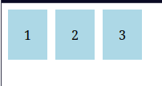
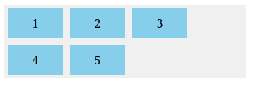
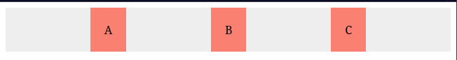
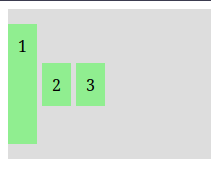

# Revisão do CSS Flexbox

## Introdução ao Flexbox e ao Modelo de Layout Flexível

- **Definição**: O Flexbox é um modelo de layout unidimensional que facilita a distribuição de espaço entre os itens em um contêiner.

- **Modelo Flex**: O modelo flexível é composto por um contêiner flexível e seus itens flexíveis. O contêiner é o elemento pai que contém os itens, e os itens são os elementos filhos que serão organizados dentro do contêiner. Todo o container flex possui dois eixos: o eixo principal (main axis) e o eixo transversal (cross axis). O eixo principal é a direção em que os itens são organizados, enquanto o eixo transversal é perpendicular ao eixo principal.

## A Propriedade `flex-direction`

- **Definição**: A propriedade `flex-direction` define a direção dos itens flexíveis dentro do contêiner definindo a direção do eixo principal. O seu valor padrão é `row`, o que significa que os itens serão organizados em uma linha horizontal, da esquerda para a direita(sendo esse o sentido padrão do idioma do navegador).

- **Valores**:
  - `row`: Organiza os itens em uma linha horizontal, da esquerda para a direita.
  - `row-reverse`: Organiza os itens em uma linha horizontal, da direita para a esquerda.
  - `column`: Organiza os itens em uma coluna vertical, de cima para baixo.
  - `column-reverse`: Organiza os itens em uma coluna vertical, de baixo para cima.

### Exemplo de Uso

  ```html
  <div class="container">
    <div class="box"> 1</div>
    <div class="box"> 2</div>
    <div class="box"> 3</div>
  </div>
  ```

  ```css
  .container {
    display: flex;
    flex-direction: row; /* ou poderia ser row-reverse, column, column-reverse */
    gap: 10px; /* para adicionar espaço entre os itens */
  }

  .box {
    background-color: lightblue;
    padding: 20px;
    text-align: center;
  }
  ```

Neste exemplo, os itens `.box` serão organizados em uma linha horizontal, da esquerda para a direita, com um espaço de 10px entre eles.

Resultando em:



Alterando o valor de `flex-direction`, você pode mudar a direção em que os itens são organizados dentro do contêiner.

## A Propriedade `flex-wrap`

- **Definição**: A propriedade `flex-wrap` controla se os itens flexíveis devem quebrar para a próxima linha ou coluna quando não houver espaço suficiente no contêiner. O valor padrão é `nowrap`, o que significa que os itens não quebrarão e permanecerão em uma única linha ou coluna, mesmo que isso cause transbordamento.
Têm ainda mais dois possiveis valores o `wrap` e o `wrap-reverse`.

- **Valores**:
  - `nowrap`: Os itens não quebrarão e permanecerão em uma única linha ou coluna, mesmo que isso cause transbordamento.
  - `wrap`: Os itens quebrarão para a próxima linha ou coluna quando não houver espaço suficiente no contêiner.
  - `wrap-reverse`: Os itens quebrarão para a próxima linha ou coluna, mas a direção de quebra será invertida (de baixo para cima ou da direita para a esquerda).

## Propriedade `flex-flow`

- **Definição**: A propriedade `flex-flow` é uma forma abreviada de definir as propriedades `flex-direction` e `flex-wrap` em um único comando. Ela permite que possamos configurar a direção dos itens flexíveis e se eles devem quebrar para a próxima linha ou coluna ao mesmo tempo.

Iremos fazer uso desta propriedade na grande maioria das vezes, a menos que não queiramos realmente definir uma das propriedades que a mesma abrevia.

### Exemplo de Uso

```html
<link rel="stylesheet" href="style.css">

<div class="container">
  <div class="box"> 1</div>
  <div class="box"> 2</div>
  <div class="box"> 3</div>
  <div class="box"> 4</div>
  <div class="box"> 5</div>
</div>
```

```css
.container {
  display: flex;
  flex-flow: row wrap; /* Define a direção dos itens como row e permite que eles quebrem para a próxima linha */
  width: 350px;
  background-color: #f0f0f0;
}

.box {
  width: 60px;
  padding: 10px;
  margin: 5px;
  background: skyblue;
  text-align: center;
}
```

Neste exemplo, os itens `.box` serão organizados em uma linha horizontal (devido a `row`) e, quando não houver espaço suficiente para acomodar todos os itens em uma única linha, eles quebrarão para a próxima linha (devido a `wrap`). O resultado será que os itens 1, 2 e 3 ficarão na primeira linha, enquanto os itens 4 e 5 ficarão na segunda linha. E para isso usamos apenas uma propriedade `flex-flow` para definir tanto a direção quanto o comportamento de quebra dos itens flexíveis.



## A Propriedade `justify-content`

- **Definição**: A propriedade `justify-content`, aplicada ao container, usada para alinhar os itens(filhos) flexíveis ao longo do eixo principal (main axis) do contêiner(pai) flexível. Ela controla a distribuição de espaço entre os itens e o alinhamento dos mesmos dentro do contêiner. O valor padrão é `flex-start`, o que significa que os itens serão alinhados ao início do eixo principal(main axis).

- **Valores**:
  - `flex-start`: Alinha os itens ao início do eixo principal.
  - `flex-end`: Alinha os itens ao final do eixo principal.
  - `center`: Alinha os itens ao centro do eixo principal.
  - `space-between`: Distribui os itens com espaço igual entre eles, sem espaço nas extremidades.
  - `space-around`: Distribui os itens com espaço igual ao redor deles, incluindo nas extremidades.
  - `space-evenly`: Distribui os itens com espaço igual entre eles, incluindo nas extremidades.

### Exemplo de Uso
```html
<link rel="stylesheet" href="style.css">

<div class="container">
  <div class="box">A</div>
  <div class="box">B</div>
  <div class="box">C</div>
</div>
```

```css
.container {
  display: flex;
  justify-content: space-evenly; /* Alinha os itens com espaço igual entre eles */
  background-color: #eee;
}

.box {
  padding: 20px;
  background-color: salmon;
}
```

Neste exemplo, os itens `.box` serão alinhados com espaço igual entre eles, incluindo nas extremidades do contêiner. O resultado será que os itens A, B e C estarão distribuídos uniformemente ao longo do eixo principal, com espaço igual entre eles e nas extremidades do contêiner.



## A Propriedade `align-items`

- **Definição**: A propriedade `align-items`, aplicada ao container, é usada para alinhar os itens(filhos) flexíveis ao longo do eixo transversal (cross axis) do contêiner(pai) flexível. Ela controla o alinhamento vertical dos itens dentro do contêiner. O valor padrão é `stretch`, o que significa que os itens serão esticados para preencher o contêiner ao longo do eixo transversal.

- **Valores**:
  - `stretch`: Estica os itens para preencher o contêiner ao longo do eixo transversal.
  - `flex-start`: Alinha os itens ao início do eixo transversal.
  - `flex-end`: Alinha os itens ao final do eixo transversal.
  - `center`: Alinha os itens ao centro do eixo transversal.
  - `baseline`: Alinha os itens com base na linha de base do texto.

### Exemplo de Uso

```html
<link rel="stylesheet" href="style.css">

<div class="container">
  <div class="box tall">1</div>
  <div class="box">2</div>
  <div class="box">3</div>
</div>
```

```css
.container {
  display: flex;
  align-items: center; /* Alinha os itens ao centro do eixo transversal */
  height: 150px;
  background-color: #ddd;
  gap: 5px;
}

.box {
  background-color: lightgreen;
  padding: 10px;
}

.tall {
  height: 100px; /* Este item é mais alto que os outros */
}
```

Neste exemplo, os itens `.box` serão alinhados ao centro do eixo transversal, o que significa que eles estarão centralizados verticalmente dentro do contêiner. O item com a classe `.tall` terá uma altura maior, mas ainda assim estará centralizado em relação aos outros itens. O resultado será que os itens 1, 2 e 3 estarão alinhados verticalmente ao centro do contêiner, com o item 1 sendo mais alto que os outros, mas todos centralizados em relação ao eixo transversal.



## A Propriedade `align-content`

- **Definição**: A propriedade `align-content`, aplicada ao container, é usada para alinhar as linhas de itens flexíveis ao longo do eixo transversal (cross axis) do contêiner(pai) flexível quando há várias linhas de itens. Ela controla o alinhamento vertical das linhas dentro do contêiner. O valor padrão é `stretch`, o que significa que as linhas serão esticadas para preencher o contêiner ao longo do eixo transversal.
Ou seja quando queremos controlar o alinhamento dos items que ocupam apenas uma linha usamos o `align-items`, mas quando queremos controlar o alinhamento dos items que ocupam mais de uma linha usamos o `align-content`, é como se fosse a versão multi-player do `align-items`.

- **Valores**:
  - `stretch`: Estica as linhas para preencher o contêiner ao longo do eixo transversal.
  - `flex-start`: Alinha as linhas ao início do eixo transversal.
  - `flex-end`: Alinha as linhas ao final do eixo transversal.
  - `center`: Alinha as linhas ao centro do eixo transversal.
  - `space-between`: Distribui as linhas com espaço igual entre elas, sem espaço nas extremidades.
  - `space-around`: Distribui as linhas com espaço igual ao redor delas, incluindo nas extremidades.
  - `space-evenly`: Distribui as linhas com espaço igual entre elas, incluindo nas extremidades.

## A Propriedade `align-self`

- **Definição**: A propriedade `align-self`, aplicada a um item flexível específico, é usada para alinhar esse item ao longo do eixo transversal (cross axis) do contêiner(pai) flexível. Ela permite que um item individual tenha um alinhamento diferente dos outros itens dentro do mesmo contêiner. O valor padrão é `auto`, o que significa que o item seguirá o alinhamento definido pelo contêiner usando a propriedade `align-items`.

- **Valores**:
  - `auto`: O item seguirá o alinhamento definido pelo contêiner usando a propriedade `align-items`.
  - `stretch`: Estica o item para preencher o contêiner ao longo do eixo transversal.
  - `flex-start`: Alinha o item ao início do eixo transversal.
  - `flex-end`: Alinha o item ao final do eixo transversal.
  - `center`: Alinha o item ao centro do eixo transversal.
  - `baseline`: Alinha o item com base na linha de base do texto.

  ## Conclusão

O Flexbox é uma ferramenta poderosa para criar layouts flexíveis e responsivos. Com as propriedades `flex-direction`, `flex-wrap`, `justify-content`, `align-items`, `align-content` e `align-self`, você pode controlar a direção, o comportamento de quebra, o alinhamento e a distribuição dos itens dentro do contêiner flexível. Ao entender e aplicar essas propriedades, você pode criar layouts complexos e adaptáveis para diferentes dispositivos e tamanhos de tela.
