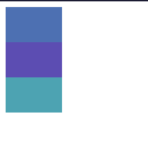
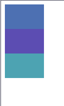

# O que é Flebox em CSS e quando deve ser usado?

O Flexbox, ou Flexible Box Layout, é um modelo de layout em CSS que permite criar layouts flexíveis e responsivos de maneira mais fácil e eficiente. Ele foi projetado para distribuir espaço entre os itens em um contêiner, mesmo quando o tamanho dos itens é desconhecido ou dinâmico.
Nos referimos ao Flexbox como um modelo de layout **unidimensional**, pois o mesmo lida com os elementos, organizando-os em um único eixo por vez, seja ele o eixo horizontal (linha) ou o eixo vertical (coluna).

O Flexbox é especialmente útil para criar layouts responsivos, onde os itens precisam se ajustar automaticamente ao tamanho da tela. Ele é ideal para situações em que você deseja alinhar itens horizontalmente ou verticalmente, distribuir espaço entre eles de maneira uniforme ou criar layouts complexos sem a necessidade de usar floats ou posicionamento absoluto.

Existem dois conceitos principais no Flexbox que devemos conhecer antes de começarmos a trabalhar com ele:

1. **Flex Container**: O elemento pai que contém os itens flexíveis. Ele é definido usando a propriedade `display: flex;` ou `display: inline-flex;`.

2. **Flex Items**: Os elementos filhos diretos do Flex Container. Eles são os itens que serão organizados e distribuídos dentro do contêiner flexível com basse em suas propriedades.

---

## Criando Exemplos de Flexbox

Vejamos um exemplo básico, onde temos um container flex &lt;main&gt; e três elementos filhos &lt;div&gt;:

```html
<link rel="stylesheet" href="style.css">

<main>
  <div id="first-div"></div>
  <div id="second-div"></div>
  <div id="third-div"></div>
</main>
```

Se definirmos apenas o width, height e background-color de nossos elementos div na folha de estilos CSS, cada elemento filho será colocado em sua própria linha porque o container não é flexível por padrão.

```css
div {
  width: 80px;
  height: 50px;
}

#first-div {
  background-color: #4d70b2;
}

#second-div {
  background-color: #5c4db2;
}

#third-div {
  background-color: #4da3b2;
}
```

Resultando em:



Mas ao definir o display do container como `display:flex`, os itens filhos serão organizados em uma única linha, lado a lado e os mesmo encolherão se for necessário para caber dentro do container:

```css
main {
  display: flex;
}

div {
  width: 80px;
  height: 50px;
}

#first-div {
  background-color: #4d70b2;
}

#second-div {
  background-color: #5c4db2;
}

#third-div {
  background-color: #4da3b2;
}
```

Resultando em:


---

## Propriedades do Flexbox

Por padrão, um container flex será um elemento de nível bloco ou `dispplay: block;`, então o próprio container estará em sua própria linha em relação a outros elementos e containers.

Agora que já começamos a entender algo sobre flex-containers e flex-items, vamos conhecer as principais propriedades flex.
Estas propriedades determinam como os itens flex serão organizados, alinhados e distribuídos dentro do container flexível.

Elas são divididas em **três categorias principais**: propriedades do container flex, propriedades dos itens flex e propriedades de alinhamento.

Algumas das propriedades mais comuns do Flexbox incluem:

- `flex-direction`: Define a direção dos itens flexíveis (linha ou coluna).
- `justify-content`: Controla o alinhamento dos itens ao longo do eixo principal.
- `align-items`: Controla o alinhamento dos itens ao longo do eixo transversal.
- `flex-wrap`: Controla se os itens flexíveis devem quebrar para a próxima linha quando não houver mais espaço disponível.

## O Modelo Flex

Vamos agora falar e entender um pouco mais do modelo flex, este modelo define como os itens flex são organizados dentro do container flexível.

Todo o container tem dois eixos:

- **Eixo principal**: O eixo ao longo do qual os itens flexíveis são organizados. Ele pode ser horizontal (linha) ou vertical (coluna), dependendo da propriedade `flex-direction`.
- **Eixo transversal**: O eixo perpendicular ao eixo principal. Ele é usado para alinar os itens flexíveis ao longo do eixo transversal usando a propriedade `align-items`.

A orientação desses eixos determina como diferentes propriedades afetarão o layout dos itens flexíveis.

Por padrão, o eixo principal de um container flex é horizontal e o seu eixo cruzado vertical.

Os itens flex são organizados na direção do eixo principal, e as propriedades de alinhamento controlam como os itens são distribuídos ao longo desses eixos.

## A Propriedade `flex-direction`

A propriedade `flex-direction` é usada para definir a direção dos itens flexíveis dentro do container flexível, definindo a direção do eixo principal. Ela pode assumir os seguintes valores:

- `row`: Os itens flexíveis são organizados em uma linha, do início ao fim do container (padrão).
- `row-reverse`: Os itens flexíveis são organizados em uma linha, do fim ao início do container.
- `column`: Os itens flexíveis são organizados em uma coluna, do início ao fim do container.
- `column-reverse`: Os itens flexíveis são organizados em uma coluna, do fim ao início do container.

### Exemplos de `flex-direction`:

```css
main {
  display: flex;
  flex-direction: row-reverse; /* Os itens serão organizados do fim ao início do container */
}
```

Resultando em:


Como podemos ver, isto inverte a ordem dos itens flexiveis, organizando-os do fim ao início do container.

Caso queiramos organizar os itens verticalmente, em uma coluna, podemos usar:

```css
main {
  display: flex;
  flex-direction: column; /* Os itens serão organizados em uma coluna, do início ao fim do container */
}
```

Resultando em:



Assim os elementos &lt;div&gt; foram organizados verticalmente porque o eixo principal agora é vertical, e os itens flexíveis são organizados do início ao fim do container no sentido de seu eixo principal.

## Conclusão

O Flexbox CSS é um modelo de layout poderoso e flexível que facilita a criação de layouts responsivos e adaptáveis. Ele é especialmente útil para organizar itens em uma única linha ou coluna, permitindo que eles se ajustem automaticamente ao tamanho do contêiner. Com as propriedades do Flexbox, você pode controlar a direção, o alinhamento e a distribuição dos itens flexíveis, tornando-o uma ferramenta essencial para desenvolvedores web que desejam criar layouts modernos e responsivos.
