# Algumas Propriedades do Flexbox e Como Funcionam

Propriedades Flex são propriedades CSS que podemos aplicar a containers flex para determinarmos a distribuição dos elementos filhos.

Cobriremos algumas das propriedades mais comummente usadas, como: `felx-wrap`, `justify-content` e `align-items`.

## Flex-wrap

A propriedade `flex-wrap` é usada para controlar se os itens flexíveis devem ser dispostos em uma única linha ou podem ser quebrados em várias linhas de forma a se adaptarem ao espaço disponível.

`flex-wrap` pode assumir  três valores:

- `nowrap`(valor padrão): Os itens flexíveis são dispostos em uma única linha, mesmo que isso cause transbordamento do container.
- `wrap`: Os itens flexíveis podem ser quebrados em várias linhas, se necessário, para se ajustarem ao espaço disponível.
- `wrap-reverse`: Os itens flexíveis podem ser quebrados em várias linhas, mas a ordem das linhas é invertida, ou seja, a última linha aparece primeiro.

### Exemplo de uso do `flex-wrap`:

No exemplo abaixo, temos três elementos &lt;div&gt;.
Vamos focarnos na width.
O container &lt;main&gt; tem uma width de 200px, enquanto seus três elementos filhos combinados têm  uma width de 240px (80px cada).

```html
<link rel="stylesheet" href="style.css">

<main>
  <div class="first-div"></div>
  <div class="second-div"></div>
  <div class="third-div"></div>
</main>
```

```css
main {
  width: 200px;
  display: flex;
  border 2px solid red;
}

div {
  width: 80px;
  height: 50px;
}

#first-div {
  background-color: #4d70b2;
}

#second-div {
  background-color: #5c4db2;
}

#third-div {
  background-color: #4da3b2;
}
```

Neste caso, os três elementos filhos não cabem em uma única linha dentro do container &lt;main&gt; devido à largura limitada de 200px, então por padrão os mesmos são reduzidos para caberem, o que pode resultar em um layout desorganizado e difícil de ler.

Resultando em:

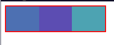

Podemos resolver isso facilmente usando a quebra de linha caso o conteúdo exceda o espaço disponível, usando a propriedade `flex-wrap: wrap;` no container &lt;main&gt;.

```css
main {
  width: 200px;
  display: flex;
  border: 2px solid red;
  flex-wrap: wrap; /* Permite que os itens sejam quebrados em várias linhas */
}
```

Resultando em:

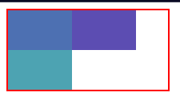

Como vemos, os elementos &lt;div&gt; são reorganizados em linhas quando excederam a largura do seu container pai. Tal como com a direção do nosso eixo principal, poderiamos também definir que os itens irão quebrar na orderm reversa usando `flex-wrap: wrap-reverse;`.

### Flex-flow

A propriedade `flex-flow` é uma propriedade abreviada que combina as propriedades `flex-direction` e `flex-wrap` em uma única declaração. Ela é usada para definir a direção dos itens flexíveis e se eles devem ser dispostos em uma única linha ou quebrados em várias linhas, tal como vimos anteriormente.

Seguindo o exemplo anterior, podemos agora fazer uso da propriedade `flex-flow` para definir tanto a direção dos itens quanto a quebra de linha em uma única declaração, onde teremos uma direção de coluna e uma quebra em reverso:

```css
main {
  width: 200px;
  display: flex;
  border: 2px solid red;
  flex-flow: column wrap-reverse; /* Define a direção dos itens e a quebra de linha */
}
```

Resultando em:

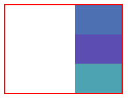

## Justify-content

A propriedade `justify-content` é usada para alinhar os itens flexíveis ao longo do eixo principal do container flexível. O eixo principal que é determinado pela propriedade `flex-direction`.

`justify-content` pode assumir os seguintes valores:

- `flex-start` (valor padrão): Os itens flexíveis são alinhados ao início do container.
- `flex-end`: Os itens flexíveis são alinhados ao final do container.
- `center`: Os itens flexíveis são centralizados dentro do container.
- `space-between`: Os itens flexíveis são distribuídos com espaço igual entre eles, mas sem espaço no início ou no final do container.
- `space-around`: Os itens flexíveis são distribuídos com espaço igual ao redor deles, incluindo o início e o final do container.
- `space-evenly`: Os itens flexíveis são distribuídos com espaço igual entre eles, incluindo o início e o final do container.

### Exemplo de uso do `justify-content`:

Seguindo o mesmo exemplo anterior, irei demonstrar apenas o valor aplicando as propriedades e CSS e seus resultados.

#### justify-content: space-between;

Distribui os itens com espaço igual entre eles, mas sem espaço no início ou no final do container.

```css
main {
  display: flex;
  justify-content: space-between; /* Distribui os itens com espaço igual entre eles */
  border: 2px solid red;
}
```

Isto resultará em:

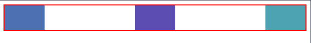

#### justify-content: space-around;

Distribui os itens com espaço igual ao redor deles, dentro do eixo principal, incluindo o início e o final do container, caso apenas exista apenas um item para distribuir ele será centralizado.

```css
main {
  display: flex;
  justify-content: space-around; /* Distribui os itens com espaço igual ao redor deles */
  border: 2px solid red;
}
```

Isto resultará em:

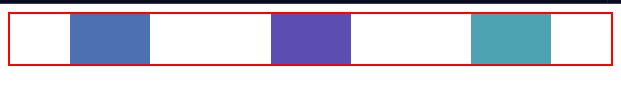

#### Justify-content: space-evenly;

Por último mas não menos importante, temos `justify-content: space-evenly;` que distribui os itens uniformemete ao longo do eixo principal, com espaço igual entre eles, incluindo o início e o final do container.

```css
main {
  display: flex;
  justify-content: space-evenly; /* Distribui os itens com espaço igual entre eles, incluindo o início e o final do container */
  border: 2px solid red;
}
```

Isto resultará em:

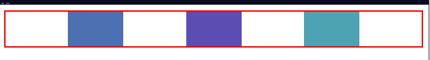

---

## Align-items

Já vimos como podemos distribuir os itens ao longo do eixo principal usando `justify-content`, mas e se quisermos alinhar os itens ao longo do eixo transversal? É aí que entra a propriedade `align-items`.

Para alinhar os itens ao longo do eixo transversal, usamos a propriedade `align-items` no container flexível. O eixo transversal é perpendicular ao eixo principal, que tem sua direção determinada pela propriedade `flex-direction`.

A propriedade `align-items` pode assumir os seguintes valores:

- `stretch` (valor padrão): Os itens flexíveis são esticados para preencher o container ao longo do eixo transversal.
- `flex-start`: Os itens flexíveis são alinhados ao início do container ao longo do eixo transversal.
- `flex-end`: Os itens flexíveis são alinhados ao final do container ao longo do eixo transversal.
- `center`: Os itens flexíveis são centralizados ao longo do eixo transversal.
- `baseline`: Os itens flexíveis são alinhados com base em suas linhas de base de texto.

### Exemplo de uso do `align-items`:

Vamos seguir usando o exemplo anterior e aplicar a propriedade `align-items` para demonstrar como os itens podem ser alinhados ao longo do eixo transversal.

Para isso vamos imaginar que o eixo principal é horizontal (com `flex-direction: row;`), então o eixo transversal será vertical.

Poderiamos então usar `align-items: center;` para centralizar os itens ao longo do eixo transversal:

```css
main {
  display: flex;
  align-items: center; /* Centraliza os itens ao longo do eixo transversal */
  border: 2px solid red;
}
```

Isto resultará em:

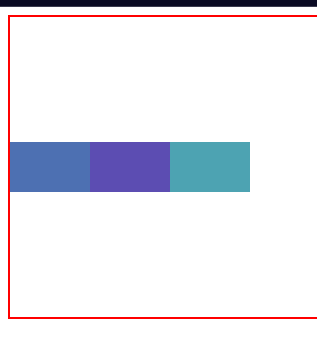

Neste exemplo, os itens flex estão centralizados ao longo do eixo transversal, o que significa que por padrão, estão alinhados verticalmente, e o `align-items: center;` os posiciona no meio do container.

Em contraste, e de modo a criar um pouco de movimento nesta secção de exemplos do align-items, poderiamos usar `align-items: flex-start;` para alinhar os itens ao início do container ao longo do eixo transversal, que será, neste caso, o topo do container:

```css
main {
  display: flex;
  align-items: flex-start; /* Alinha os itens ao início do container ao longo do eixo transversal */
  border: 2px solid red;
}
```

Isto resultará em:

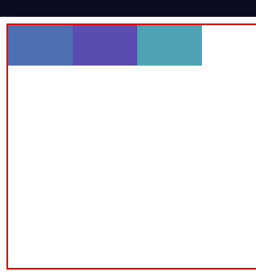

O oposto disso seria usar `align-items: flex-end;` para alinhar os itens ao final do container ao longo do eixo transversal, que será, neste caso, a parte inferior do container.

Existe uma propriedade interessante que é o `align-items: stretch;` este é o valor padrão onde os itens flexiveis são esticados ao longo do eixo transversal para preencher o container.
Vejamos como isso funciona:

```css
main {
  display: flex;
  align-items: stretch; /* Estica os itens para preencher o container ao longo do eixo transversal */
  border: 2px solid red;
}
```

Isto resultará em:

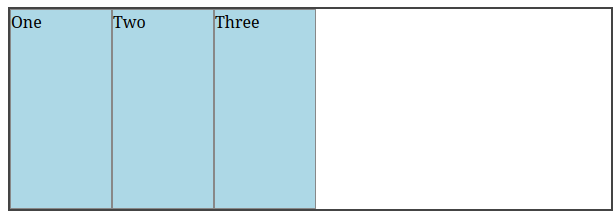

Por fim vejamos a propriedade align-self, que é usada para alinhar um item flexível individualmente ao longo do eixo transversal, sobrescrevendo o valor definido por `align-items` para esse item específico.

```html
<link rel="stylesheet" href="style.css">

<div class="container">
  <div class="box">One</div>
  <div class="box">Two</div>
  <div class="box special">Three</div>
</div>
```

```css
.container {
  display: flex;
  align-items: flex-start; /* Alinha os itens ao início do container ao longo do eixo transversal */
  border: 2px solid #444;
  height: 200px; /* Define a altura do container para demonstrar o alinhamento */ 
}

.box {
  width: 100px;
  border: 1px solid #888;
  background-color: lightblue;
  margin: 4px;
}

.special {
  align-self: stretch; /* Sobrescreve o alinhamento para este item específico, esticando-o ao longo do eixo transversal */
  background-color: lightcoral; /* Apenas para destacar o item especial */
}
```

Resultando em:

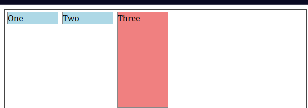

Neste exemplo, o item "Three" tem a classe `special` que aplica `align-self: stretch;`, fazendo com que ele se estique para preencher o container ao longo do eixo transversal, enquanto os outros itens permanecem alinhados ao início do container devido ao `align-items: flex-start;` aplicado ao container pai.

Vejamos agora o que acontece se aplicarmos a propriedade `align-self: center;` ao item "Three" deste mesmo exemplo:

```css
.
container {
  display: flex;
  align-items: flex-start; /* Alinha os itens ao início do container ao longo do eixo transversal */
  border: 2px solid #444;
  height: 200px; /* Define a altura do container para demonstrar o alinhamento */ 
}

.box {
  width: 100px;
  border: 1px solid #888;
  background-color: lightblue;
  margin: 4px;
}

.special {
  align-self: center; /* Sobrescreve o alinhamento para este item específico, centralizando-o ao longo do eixo transversal */
  background-color: lightcoral; /* Apenas para destacar o item especial */
}
```

Resultando em:

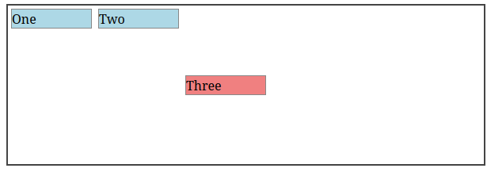

Neste caso, o item "Three" é centralizado ao longo do eixo transversal, enquanto os outros itens permanecem alinhados ao início do container devido ao `align-items: flex-start;` aplicado ao container pai.

Bom acho que entendeste a ideia, podes experimentar outros valores para `align-self` como `flex-end` ou `baseline` para ver como eles afetam o alinhamento do item específico dentro do container flexível.

Existem ainda outras propriedades e valores relacionados ao Flexbox que podemos explorar de modo a criar um layout responsivo e flexivel, mas estes são os mais comummente usados e essenciais para entender como o Flexbox funciona. Com a prática, podes experimentar diferentes combinações dessas propriedades para criar layouts únicos e adaptáveis às necessidades do teu projeto.
