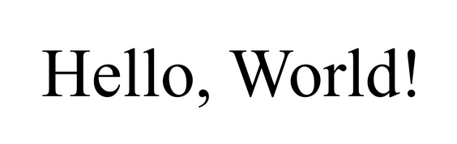
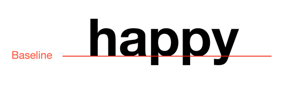
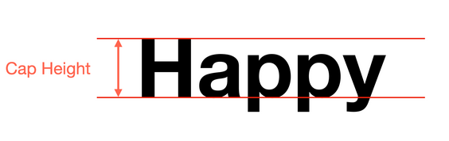
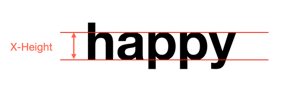
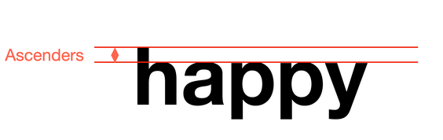
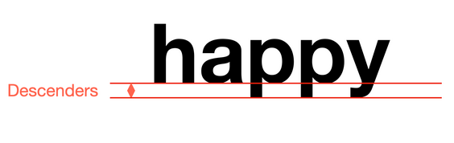
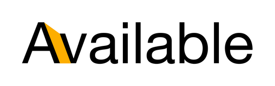
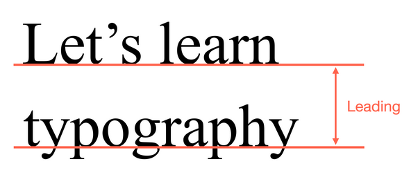

# Quais são os fundamentos da tipografia?

A tipografia é a arte e técnica de organizar tipos de fonte, para tornar a linguagem escrita legível, atraente e eficaz. "Type" refere-se a como os caracteres são  desenhados, enquanto "graphy" se refere à escrita. Os fundamentos da tipografia são os princípios básicos que guiam a escolha e o uso de fontes para criar designs eficazes e legíveis. 

Os fundamentos da tipografia incluem:

1. **Escolha da Fonte**: A seleção da fonte é crucial para transmitir a mensagem desejada. Diferentes fontes têm diferentes personalidades e podem evocar emoções distintas.

2. **Tamanho da Fonte**: O tamanho da fonte afeta a legibilidade. Fontes muito pequenas podem ser difíceis de ler, enquanto fontes muito grandes podem parecer desproporcionais.

3. **Espaçamento**: O espaçamento entre letras (kerning), palavras (tracking) e linhas (leading) é essencial para a legibilidade. Um bom espaçamento pode melhorar a leitura, enquanto um espaçamento inadequado pode dificultá-la.

4. **Alinhamento**: O alinhamento do texto (esquerda, direita, centralizado ou justificado) pode influenciar a aparência geral e a legibilidade do conteúdo.

5. **Contraste**: O contraste entre o texto e o fundo é importante para garantir que o texto seja legível. Cores de alto contraste geralmente são mais fáceis de ler.

6. **Hierarquia Visual**: A hierarquia visual é criada usando diferentes tamanhos, pesos e estilos de fonte para guiar o leitor através do conteúdo e destacar informações importantes.

7. **Consistência**: Manter a consistência na escolha de fontes, tamanhos e estilos ao longo de um projeto é fundamental para criar uma aparência coesa e profissional.

8. **Legibilidade**: A legibilidade é a facilidade com que o texto pode ser lido. Isso envolve a escolha de fontes claras, o uso adequado de espaçamento e a consideração do contexto em que o texto será lido.

Esses fundamentos são essenciais para criar designs tipográficos eficazes que comuniquem a mensagem de maneira clara e atraente.

## Familias Tipograficas

Vamos começar a falar sobre as familias tipograficas, que são um dos fundamentos mais importantes da tipografia. As famílias tipográficas são conjuntos de fontes que compartilham características visuais semelhantes, como estilo, peso e proporção. Elas permitem que os designers criem hierarquias visuais e mantenham a consistência em seus projetos.

Dois exemplos muito importantes de famílias tipográficas são  a Serif e Sans Serif.

### Serif

A família Serif tem um estilo clássico com pequenas linhas nas extremidades dos caracteres.

Famílias Serif, são comumente usadas para materiais impressos, como livros e jornais, devido à sua legibilidade em tamanhos menores.

Alguns exemplos de fontes Serif incluem Times New Roman, Garamond e Georgia.

### Sans Serif

Em contraste, a família Sans Serif tem um estilo mais moderno e limpo, sem as pequenas linhas nas extremidades dos caracteres.

Famílias Sans Serif são frequentemente usadas para materiais digitais, como sites e aplicativos, devido à sua clareza em telas.

Alguns exemplos de fontes Sans Serif incluem Arial, Helvetica, Futura e Roboto.

### Outras Familias Tipograficas

Existem ainda outras classificações de famílias tipográficas, como Script, Display, Monospace, entre outras, cada uma com suas características e usos específicos.

## Projetos para fontes

Famílias tipográficas são como projetos para fontes, e fontes podem também ser agrupadas se compartilharem caracteristicas visuais semelhantes, como estilo, peso e proporção.

Por exemplo, a família Times New Roman inclui várias fontes, como Times New Roman Regular, Times New Roman Bold, Times New Roman Italic, entre outras. Cada uma dessas fontes tem um estilo e peso diferente, mas todas compartilham as mesmas características visuais que definem a família Times New Roman.

Variações dentro da mesma família normalmente incluem:

- **Peso**: A espessura dos caracteres, como Regular, Bold, Light, etc.

- **Estilo**: A inclinação dos caracteres, como Regular, Italic, Oblique, etc.

- **Proporção**: A largura(espaço horizontal) dos caracteres, como Condensed, Extended, etc.

## Elementos fundamentais da tipografia

Além das famílias tipográficas, existem outros elementos fundamentais da tipografia que são essenciais para criar designs eficazes. Esses elementos incluem:

-**Baseline**: A linha imaginária onde os caracteres se alinham:

-**Cap Height**: A altura das letras maiúsculas, medida a partir da linha de base:

-**X-Height**: A altura das letras minúsculas, medida a partir da linha de base:

-**Ascender**: A parte da letra que se estende acima da altura das letras minúsculas:

-**Descender**: A parte da letra que se estende abaixo da linha de base:

Esses elementos são fundamentais para entender a estrutura das letras e como elas se relacionam entre si, o que é essencial para criar designs tipográficos eficazes e legíveis.

Existem ainda alguns conceitos um pouco mais avançados, como:

-**Kerning**: O ajuste do espaço entre caracteres individuais para melhorar a legibilidade e a estética do texto.

-**Tracking**: O ajuste do espaço entre grupos de caracteres ou palavras para criar uma aparência mais uniforme, isto afeta o quão denso ou aberto o texto parece.

-**Leading**: O espaço vertical entre linhas de texto, é medido da base de uma linha para a próxima, que pode afetar a legibilidade e a aparência geral do design.

## Conclusão

Familiarizarmo-nos com taís conceitos é essencial para sabermos como escolher a fonte certa para nossos projetos, e como ajustar o espaçamento para criar designs tipográficos eficazes e legíveis.

Tipografia pode também ser utilizada para criarmos hierarquia visual, destacando áreas de maior importancia e guiando o leitor através do conteúdo de maneira eficaz.
Fontes maiores geralmente são usadas de maneira a indicar uma maior importancia de determinado conteúdo.

Ter conhecimento básico de tipografia é essencial para projetar aplicações e sites visualmente atraentes e fáceis de usar, somando uma experiência de usuário positiva.

Ao entender fontes, espaçamento e hierarquia, podemos criar experiências visuais que melhoram a legibilidade de nosso conteúdo e reforçam a identidade de nossa marca.
