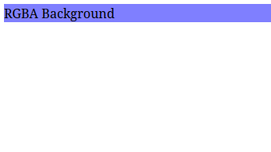

# Revisão Sobre Cores em CSS

## Teoria das Cores

- Definição de Teoria das Cores: Este é o estudo de como as cores interagem entre i e como elas afetam nossa percepção. Abrange relacionamentos de cores, harmonia de cores e o impacto psicológico da cor.

- Cores Primárias: Essas cores que são amarelo, azul e vermelho, são os tons fundamentais dos quais todas as outras cores são derivadas.

- Cores Secundárias: Essas cores resultam da mistura de quantidades iguais de cores primárias. Verde, laranja e roxo são exemplos de cores secundárias.

- Cores Terciárias: Essas cores resultam da combinação de uma cor primaria com uma cor secundária vizinha. Amarelo-verde, Azul-verde e Azul-violeta são exemplos de cores terciárias.

- Cores Quentes: Essas cores que incluem vermelhos laranjas e amarelos, evocam sensaçoes de conforto, calor e aconchego.

- Cores Frias: Essas cores que incluem azuis, verdes e roxos, evocam sentimentos de calma, serenidades e profissionalismo.

- Roda de Cores: A Roda de Cores é um diagrama circular que mostra como as cores se relacionam entre si. É uma ferramenta essencial para designers porque os ajuda a selecionar combinações de cores.

- Esquemas de Cores Análogas: Esses esquemas de cores criam experiencias coesas e tranquilizadoras. Eles possuem cores análogas, que são adjacentes umas às outras no círculo cromático.

- Esquema de Cores Complementares: Esses esquemas de cores criam alto contraste e impacto visual. Suas cores estão localizadas em extremos opostos do círculo cromático, em relação umas às outras.

- Esquema de Cores Monocromáatico: Para este esquema de cores, todas as cores são derivadas da mesma cor de base ajustando seu brilho, escuridão e saturação. Isso evoca uma sensação de unidade e harmonia ao mesmo tempo que cria contraste.

- Esquema de cores Triadico: Este esquema de cores contêm cores vibrantes. Feito de cores que estão aproximadamente equidistantes umas das outras. Se eles estiverem conectados, formam um triângulo equilátero na roda das cores.

## Diferentes formas de trabalhar com cores em CSS

- Cores Nomeadas: Essas cores são nomes de cores predefinidos reconhecidos pelos navegadores. Exemplos incluem blue, darkred, lightgreen.

- Função RGB: RGB significa red green e blue - as cores primárias da luz. Essas três cores são combinadas em diferentes intensidades para criar uma ampla variedade de cores. A função rgb() permite que defina-mos cores usando o modelo de cores RGB.

Exemplo:
    
        ```html
        <link rel="stylesheet" href="styles.css">
        <p>RGB COLOR</P>
        ```

        ```css
        p {
            color: rgb(255, 0, 0);
        }
        ```
        Resultado do exemplo
        

- Função rgba(): Esta função adiciona um quarto valor, alpha, que controla a transparência da cor. Se não for fornecido, o valor alpha padrão é 1.

Exemplo:

        ```html
        <link rel="stylesheet" href="styles.css">
        <div>RGBA BAckground</div>
        ```

        ```css
        div {
            background-color: rgba(0, 0, 255, 0.5);
        }
        ```
        Resultado do Exemplo
        
