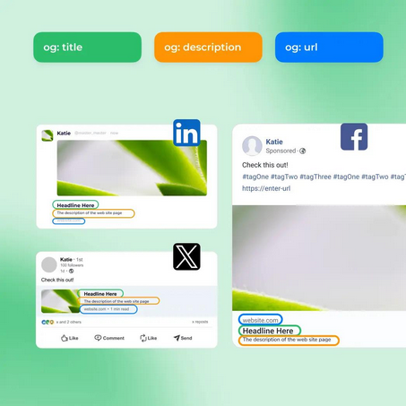
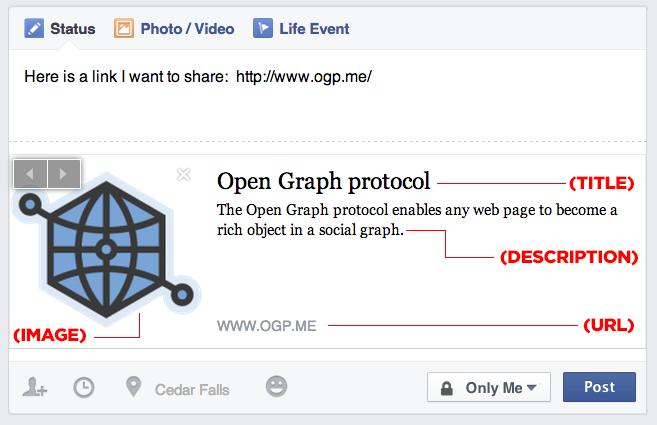

#		Tags Open Graph

 Tags Open Graph são o protocolo que nos permite controlar como o conteúdo de nosso site aparece nas várias midias sociais como o X ou qualquer outro producto da Meta.
 Ao definir essas propriedades, que são meta tags colocadas na head de uma página HTML, podemos atrair usuarios para que interajam com nosso conteúdo, estas podem ser definidas por meio de uma coleção de elementos meta, na secção head do documento HTML.
 
- og:title
    Define o título usado nas postagens de nossa página em redes sociais.

```html
 <meta property="og:title" content="Seu título"/> 
```

- og:type
    Define o tipo de conteúdo que estamos a postar

```html
 <meta property="og:type" content="Website"/> .
```
og:img
    Define a imagem que será exibida dentro dessa mesma postagem.

```html
 <meta property="og:img" content="link para imagem"/>
```

- og:URL
Define a URL que será usada para as postagens contendo determinada página web, a quando nosso usuario clicar.
 
```html
 <meta property="og:URL" content="https://link.com/>
```

* * *

## Porque Open Graph importa?

### 1. Melhor aparência ao partilhar links

Sem Open Graph:

- preview de página quebrado
- imagem errada
- texto aleatorio
- aspecto geral do site pouco profissional ao ser partilhado

Com Open Graph:

- preview limpo
- imagem de marca forte
- branding consistente

### 2. Maior Taxa de Conversão

Um bom preview ajuda a aumentar:

- CTR
- engajamento
- partilhas diretas
- visitas

Especialmente importante se:

- tens portfolio
- blog
- website pessoal
- canal no youtube

### 3. Branding Profissional

Quando alguem partilha o teu WebSite e aparece:

- imagem bonita
- título claro
- descrição boa

O projeto parece imediatamente mais profissional

#### Exemplo visual típico



Exemplo em post de Facebook:



* * *

### Open Graph não é SEO

Open Graph não é SEO otimizado para o Google Search.
Mas ajuda:

- partilhas sociais
- tráfego
- engajamento
- apresentação da marca

SEO usa mais:

- title
- meta description tags
- headings
- performance
- conteúdo

### Boas Práticas

#### Imagem

Usa:

- 1200x630 px
- formato .png ou .jpg
- pouco texto
- visual limpo

#### Títulos

Mantém:

- curtos
- claros
- diretos

#### Descrição

Ideal:

- 1-2 frases
- objetiva
- focada no valor

* * * 

### Exemplo Moderno Completo

Iremos agora ver um exemplo do uso de Open Graph Tags, irei usar a minha Organização: Dev Assembly para a criação deste exemplo, se ainda não conheces visita a nossa página de org aqui no github.

```html
<head>
    <title>Dev Assembly</title>
    
    <meta name="description"
          content="Projetos, colaborações, estudos e conteúdo sobre desenvolvimento">
         
    <!-- Meta Content-->
    <meta property="og:title" content="Dev Assembly">
    <meta property="og:description" content="Projetos colaborativos e aprendizagem activa de Web moderna">
    <meta property="og:image" content="https://devassembly.com/imageCover.png">
    <meta property="og:URL" content="https://devassembly.com">
    <meta property="og:type" content="website">
</head>
```

### Algo importante para GitHub Pages

Se fizeres projetos usando:

- GitHub Pages
- portfolios
- landing pages
- documentação

Open Graph fará toda a diferença pois teus links serão frequentemente partilhados em plataformas sociais, e mesmo o projeto mais simples terá um ar profissional.
